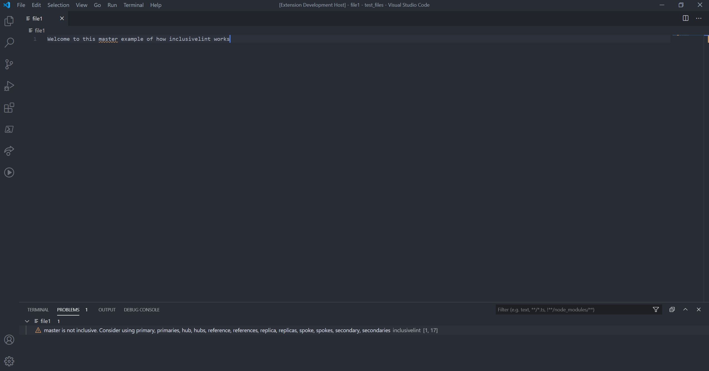

# Inclusivelint VSCode Extension 

This repo is aims to add the capabilities from [inclusivelint](https://github.com/inclusivelint/inclusivelint) as a
extension on Visual Studio Code. It will show non inclusive words while you write your code, and also show some suggestions,
as shown in the image below:

## Downloading the extension

You can download this extension inside Visual Studio Code, just search for inclusivelint.
Besides, there is this [link](https://marketplace.visualstudio.com/items?itemName=inclusivelint.inclusivelint) to get it
from the marketplace.

## Contributing

Contributions are more then welcome in this repository.
If you experience some bugs or there are some features you'd like to have as part of the tool,
please feel free to open an issue describing the situation to us.

If you want to open a PR, the suggested way of doing this is the following:

1. Fork this repository
2. Clone the fork
3. Create a branch on the fork with a name that follows the pattern <github_user>/<new_feature>
4. Once the work is done, feel free to open a PR to the main branch of this repo